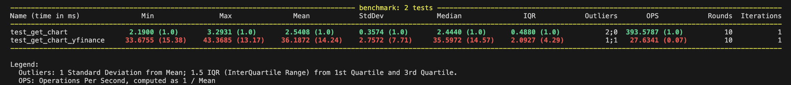

# Yafin

Unofficial [Yahoo!Ⓡ finance](https://finance.yahoo.com) API client.

- Not affiliated with Yahoo, Inc.
- Open source library that uses publicly available APIs.
- Intended for research, educational purposes and personal use only.
- Synchronous and asynchronous.
- Not returning pandas dataframes (because why?).
- Uses caching and utilizes singleton pattern in symbol class to save resources.
- Minimal and build on [curl-cffi](https://github.com/lexiforest/curl_cffi)
- More, than 10x faster, than other Yahoo finance clients. Run the tests yourself - `make test-perf` (All tests running synchronously and returning pandas DataFrame.)

**Documentation**: [https://lukinkratas.github.io/yafin/](https://lukinkratas.github.io/yafin/)
